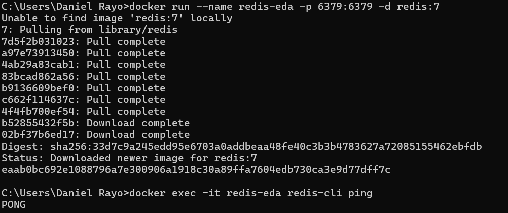
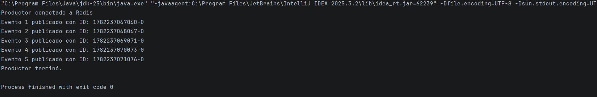
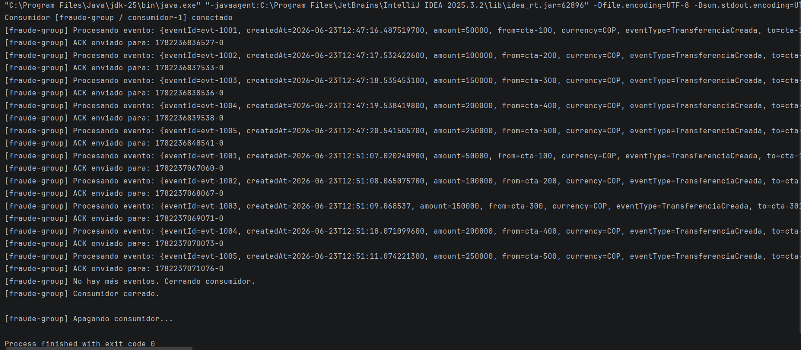

# EDA with Redis Streams

A demonstration of an event-driven architecture using Redis Streams as the broker. The system simulates bank transfers where multiple services react to the same event without being directly coupled to each other.

## How it works

When a transfer occurs, the producer publishes a `TransferenciaCreada` event to a Redis stream. Three independent consumer groups (fraud detection, notifications, and audit) read that same event without competing with each other. If a consumer crashes before confirming the processing, the event stays pending and another consumer can claim it.

```
Producer → XADD → banco.transferencias
                          ↓
              fraude-group    → consumidor-1 → ACK
              notif-group     → consumidor-1 → ACK
              auditoria-group → auditor-1 → CRASH
                                  → XPENDING detects orphan events
                                  → auditor-2 → XCLAIM + ACK
```

## Requirements

- Docker Desktop
- Java 21
- Maven

## How to run

**1. Start Redis**

```bash
docker run --name redis-eda -p 6379:6379 -d redis:7
docker exec -it redis-eda redis-cli ping
```

Should respond with `PONG`.



**2. Create the consumer groups**

```bash
docker exec -it redis-eda redis-cli
```

```
XGROUP CREATE banco.transferencias fraude-group $ MKSTREAM
XGROUP CREATE banco.transferencias notif-group $
XGROUP CREATE banco.transferencias auditoria-group $
```

**3. Run the Producer**

Run `Productor.java` from IntelliJ. It publishes 5 `TransferenciaCreada` events to the stream with a one-second delay between each one.



**4. Run the Consumer**

Run `Consumidor.java` from IntelliJ. It reads and processes events from the `fraude-group` consumer group and sends an ACK for each one. When there are no more events, it shuts down on its own.



## Crash simulation

To simulate a consumer crashing before confirming the processing, `XPENDING` is used to inspect orphan events and `XCLAIM` allows another consumer to take ownership of them:

```
# Check pending events
XPENDING banco.transferencias auditoria-group - + 10

# Another consumer claims the orphan events
XCLAIM banco.transferencias auditoria-group auditor-2 0 <ID>
XACK banco.transferencias auditoria-group <ID>

# Verify nothing is left pending
XPENDING banco.transferencias auditoria-group - + 10
```

## Project structure

```
eda-redis-streams/
├── src/main/java/edu/eci/arsw/
│   ├── Productor.java
│   └── Consumidor.java
├── docs/
│   ├── redis-ping.png
│   ├── productor.png
│   └── consumidor.png
└── pom.xml
```

## Key concepts

- **Stream**: persistent channel where events live. Unlike Pub/Sub, events are not lost if the consumer is not connected.
- **Consumer Group**: allows multiple services to read the same stream independently without competing with each other.
- **ACK**: confirmation that an event was processed. Without an ACK the event stays pending.
- **XCLAIM**: failure recovery mechanism — allows another consumer to take ownership of an orphan event.